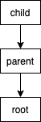

# Effects Runtime

For an overview of what this package enables and interactive exampels, see [the effectsjs website](https://effects.js.org/).

### Technical overview

Performing, handling and recalling are handled by generators under the hood. The [babel transform plugin](../babel-plugin-effects) transforms newly introduced keywords to abstract away the generator syntax.

Consider the following variables

```javascript
const getIntegerHandler = 'getInteger';

const GetIntegerEffect = () => ({
  type: getIntegerHandler
});
```

And compare the following code

```javascript
const main = async () => {
    'use effects';
    try{
        return perform GetIntegerEffect();

        return integer
    }handle getIntegerHandler with (e){
        recall 5;
    }
}
```

To the functionally equivalent code:

```javascript
const handler = {
  *[getIntegerHandler](e, resume){
    return resume(5);
  }
};

const frame = function*(){
  return  yield performEffect(GetIntegerEffect());  
}

const program = withHandler(
  handler,
  frame()
);

const main = () => runProgram(program());
```

Above, we see all of the features of effects implemented first with the proposed effects syntax and second in runtime syntax.

The rest of this document will deal with the latter, to demonstrate _how_ effects are implemented for the proposal.

## The Virtual Stack

Algebraic Effects require a control flow that is not available to us in the JavaScript programming language. Fundamentally, all we have is the run-of-the-mill call-stack. As functions are called, they are pushed onto the stack, evaluated and popped-off, returning values into the last call-site until the stack is empty.

In order to simulate one-shot continuations, we need to be able to redirect when and how values get popped off the stack, and _where_ they return to. JavaScript runtimes don't have anything available to do this natively, so instead we need to simulate it.

*The Virtual Stack* is this simulation: and instead of a stack, we treat it as a linked list. A Frame in the Virtual Stack is an iterator.

### Aside, Generators

Let's create a `GeneratorFunction`

```javascript
function* gen(){
  const a = yield `I'm`;
  const b = yield `a`;
  const c = yield `generator`;
  return `${a}-${b}-${c}`;
}
```

We'd _drive_ it like so:

```bash
> const g = gen()
undefined
> g.next('val 1');
{ value: "I'm", done: false }
> g.next('val 2');
{ value: 'a', done: false }
> g.next('val 3');
{ value: 'generator', done: false }
> g.next();
val 2-val 3-undefined
{ value: 'val 2-val 3-undefined', done: true }
```

Now let's just think about what's happening for a second. The `gen` function _looks_ like a normal function: it has a declaration, signature, body. It returns a value.

The first difference is that it must be _driven_: Invoking the function does not cause it to execute. Instead invoking the function returns something that implements [the iterator protocol](https://developer.mozilla.org/en-US/docs/Web/JavaScript/Reference/Iteration_protocols#The_iterator_protocol). This is what it means to _drive_ the function.

We did it manually above, another way to do it would be to use a `for..of` loop:

```javascript
for(const x of gen()){
  process.stdout.write(`Value: ${x},`);
}

// > Value: I'm,Value: a,Value: generator,true
```

Or we could use `Array.from`

```javascript
Array.from(gen());

// > ["I'm", "a", "generator"]
```

Notice however that we were able to do something even more interesting when driving it manually: pass values _into_ the function. This provides three incredibly useful properties:

1) Perform routines like a regular old function.
2) Preserve the context that a generator was executed in.
3) Maintain the ability to halt the function -- without returning -- and resume "later" recieving new values.

## Stack Frames 

Here's type signature for a virtual stack frame:

```typescript
type StackFrame = (Generator | AsyncGenerator) & StackFrameSymbols;
```

Remember, `GeneratorFunction` (and `AsyncGeneratorFunction`) return _something_ that implements the Iterator Protocol. These are typed as `Generator` and `AsyncGenerator`, but they're really nothing more than something that exposes iterator interface as far as types are concerned. How they behave internally is _kind of_ irrelevant at this point.

A Stack Frame is the intersection of this iterator protocol with the following interface:

```typescript
interface StackFrameSymbols {
  [ReturnFrame]?: StackFrame | Continuation | null;
  [HandlerReference]?: Handler;
}
```

These are symbols that may or may not be present on the iterator: a return frame, and a handler reference.

As mentioned before, our Virtual Stack isn't a stack at all: it's a singly-linked list. We build this list up by linking generators to _other_ generators. Any given `StackFrame` is the child of a `StackFrame` that it may return to. A parent has no knowledge of any children, only where it itself may return to. 

The active state of the Virtual Stack corresponds to the [internal properties](http://www.ecma-international.org/ecma-262/6.0/#sec-properties-of-generator-instances) for generators. At any given time, there should be one StackFrame that has the internal property of `executing`, the rest should be either `suspended` or `completed`.

## The Stack Interpreter

Up until now we've talked about generators, StackFrames and this theoretical virtual stack. 

So far, we know that frames can be linked together:




```javascript

function* child(){
  return null;
}

function* parent(){
  return yield child();
}

function* root(){
  return yield parent();
}

```

<br/>

The heart of what the Effects Runtime provides are the rules for evaluating stack frames: an interpreter for the virtual stack.

The interpreter has a few important qualities:

First, it doesn't manage or maintain any internal state. It recieves a single iterator that represents the _next_ frame to evaluate and an optional value. It then calls `next` on the frame passing in the optional value.   

Second, it manages the state of the frame it just evaluated: 
  
  - If the result of the `next` operation yielded a stack frame, attach the current frame to the `[ReturnFrame]` property and iterpret the yielded frame.
  - If the result of the `next` operation indicates that the iterator is `done`, check to see if the current frame has a return frame. If so, interpret the return frame with the value yielded by the current frame.


  


This entire process is initiated by a call to the function `runProgram` provided by the runtime:

```javascript

const result = await runProgram(root())

```

The interpreter will continue evaluating until there are no frames to evaluate, and return the value yeilded by the last frame.

## Effect Handlers

We've covered `StackFrame`s and how the Virtual Stack is evaluated, the last missing piece is Effect Handlers. Above, we looked at the type definition for `StackFrame` and saw that it was the intersection of a `Generator` and the interface `StackFrameSymbols`. Of which, had a property called `HandlerReference` that could optionally contain a `Handler`. Let's look at all of the associated definitions:

```typescript
export interface Handler {
  [key: string]: HandlerDefinition;
  [index: number]: HandlerDefinition;
}

export type HandlerDefinition = (
  data: any,
  resume: Continuation
) => Generator<any, any, any>;

export type EffectType = string | number | symbol | undefined;

export interface Effect {
  type: EffectType;
  data?: any;
}
```

A handler is just an object that associates `EffectType`s with `HandlerDefinition`s. In the intro, we defined an effect and effect handler like this:

```javascript
const handler = {
  *[getIntegerHandler](e, resume){
    return resume(5);
  }
};
```

So an `EffectDefinition`, is a `GeneratorFunction`. An `Effect`, is an plain-old-javascript-object that associates a type with some data. And a `Handler` is a POJO that associates `EffectType`s with `EffectDefinition`s.

Any `StackFrame` may hold a reference to a `Handler` but the runtime supplies a special method for associating handlers and frames:

```javascript
const frameWithHandler = withHandler(handler, root);
```

This creates the following structure:


*note on why this exists*

Even though it's not possible to do under the proposed syntax, this enables us to write runtime code for effects that don't recall. Under the proposed javascript syntax, an `EffectHandler` that doesn't recall is considered undefined behavior. But in the runtime, it's not only possible -- but well defined. In the event that an effect handler does not recall, the stack interpreter will eject into the parent from of the effect handler.

By providing this buffer frame, we gaurantee that the frame is given to the stack interpreter _exactly once_, indicating that all child frames are no longer relevant. 

## Perform

